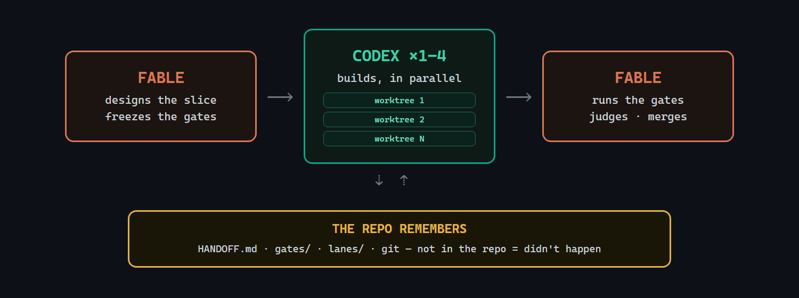

# architect-loop

**Claude handles planning and review; a cheap model — DeepSeek by default,
run via [`pi`](https://pi.dev) — handles implementation and research.** Two Claude
Code skills wire that split into a repo-centered loop: specs and gates are written
first, the builder works in fresh contexts, and Fable reviews the evidence before
anything is integrated.

> ⚠️ **Run this in a container.** `pi` has no sandbox — a builder runs with full
> host access and your repo's source is sent to a third-party (overseas) model
> API. Use the bundled devcontainer (or any container/VM) and don't point it at
> secrets or code you can't send out. This is the deliberate trade for a
> provider-agnostic, rock-cheap builder; if that trade is wrong for you, the
> upstream [DanMcInerney/architect-loop](https://github.com/DanMcInerney/architect-loop)
> runs the same loop on flat-rate Codex instead.

## Install (30 seconds)

```bash
git clone https://github.com/pcomans-bot/architect-loop-pi
cd architect-loop-pi && ./install.sh     # Windows: .\install.ps1
npm i -g --ignore-scripts @earendil-works/pi-coding-agent   # the builder (pi)
export DEEPSEEK_API_KEY=sk-...            # see dispatch.md to use GLM/Kimi/etc.
```

`./install.sh --project` installs the **skills** to the current repo
(`./.claude/skills/`) instead of `~/.claude/skills/`; `pi` and the `pi-search-hub`
package always install globally. You need
[Claude Code](https://claude.com/claude-code) on any paid plan, `pi`, and a
`DEEPSEEK_API_KEY`. `install.sh` also installs the
[`pi-search-hub`](https://pi.dev/packages/pi-search-hub) package for the
`web_search` tool; set `TAVILY_API_KEY` for better search, else it uses keyless
DuckDuckGo.

## Use (two commands)

```
/architect                                      # the build loop
/architect-research <what you're considering>   # the research loop
```

`/architect` runs one work block: judge the last run, spec the next slice,
dispatch builders. `/architect-research` is for when you're still deciding
*what* to build — its cited report feeds the build loop's PRD.

## /architect



One short Fable session per work block — judgment only, it never writes code:

- **Spec + gates first.** Fable specs a one-PR slice, splits it into 1–4
  lanes whose file sets are checked for overlap, and commits the acceptance gates to
  `docs/gates/` *before* any builder starts. Gates are read-only; a builder
  edit to a gate file fails the slice automatically.
- **Parallel isolated builders.** One fresh `pi` run (xhigh) per lane, each in
  its own git worktree. Builders must argue with the spec before building (silent
  compliance = defect), build only their declared files, and report raw results.
  They're told not to commit; the architect verifies they didn't.
- **Fable judges and integrates.** It runs the gate commands itself (builder
  claims are hearsay), reads the diff against the spec's intent (passing
  tests ≠ mergeable work), then commits and merges passing lanes. Judgment
  happens in a fresh session because the cited evidence favors fresh-context
  review.
- **The repo is the only memory.** `docs/HANDOFF.md` (a short table of
  contents, pruned every session), `docs/gates/`, `docs/lanes/`, git
  history. Not in the repo = didn't happen.
- **Supervision built in.** Liveness checks on dispatched runs, stall triage
  (diagnose the child process tree, kill the narrowest thing), explicit
  timeouts on every long command.

## /architect-research


Scout-first, like the production deep-research systems — no fixed lane
taxonomy:

- **A cheap pi scout maps the topic** (~10 searches): canonical
  terminology, the load-bearing systems and papers, the named people, the
  topic's natural fault lines. Skipped for comparisons and fact-finds.
- **Fable designs 3–6 topic-specific lanes** from the scout's map, drawing
  per-source-class tactics from a library (academic citation snowballing,
  dependents-not-stars repo evidence, emerging-vs-hype gating, production
  pattern mining, expert tracking) — checked for overlap and gaps before
  dispatch.
- **Parallel pi researchers** run under hard budgets: search caps, ≤5
  subjects per lane, saturation stop, strict findings discipline (URL + date
  + quote + confidence tag; NOT FOUND beats inference; no recommendations).
  They search with the `web_search` tool and curl the keyless data
  APIs. Expert opinion runs as a second wave, roster-seeded by the first.
- **Fable verifies and writes.** ≥2 independent sources per load-bearing
  claim, adversarial falsification searches, citations only from URLs
  actually fetched — then one author writes one decision-oriented report.
  Gathering parallelizes; synthesis never does.

## Why this shape

Each design choice is source-backed (full citations in
[DESIGN.md](DESIGN.md)):

- Weak planners hurt more than weak executors — so the architect model does
  the design, and builders get explicit specs.
- Manager + worktree-isolated workers is a well-supported topology for
  shared-artifact software work; naive shared-file coordination collapses
  throughput.
- Frozen external gates beat trusting the agent — but agents game visible
  tests and their passing PRs are frequently unmergeable, so the architect
  also reads the diff.
- Memory files rot — so the handoff stays a short map, and detail lives in
  linked gate/lane files.
- The surveyed production deep-research systems use planner-designed
  decomposition rather than fixed lanes — so research lanes are designed per
  topic, after a scout pass.

## What's in the box

| File | What it is |
|---|---|
| [DESIGN.md](DESIGN.md) | The design document — 12 enforced rules, failure-mode table, cited sources |
| [skills/architect/SKILL.md](skills/architect/SKILL.md) | The architect role: hard rules + procedure |
| [skills/architect/dispatch.md](skills/architect/dispatch.md) | `pi` dispatch commands, builder block, worktree fan-out, model switching, stall triage |
| [skills/architect/research.md](skills/architect/research.md) | Slice-scale inline fact-check fan-out |
| [skills/architect/HANDOFF.template.md](skills/architect/HANDOFF.template.md) | The repo-memory file |
| [skills/architect-research/SKILL.md](skills/architect-research/SKILL.md) | Research orchestration: scout → design → fan out → verify → write |
| [skills/architect-research/lanes.md](skills/architect-research/lanes.md) | Scout block + source-class tactics library with verified endpoints |
| [tests/validate_skills.py](tests/validate_skills.py) | Repo sanity checks (frontmatter limits, links, fences) |

## FAQ

**Do I need API keys?** Yes — a `DEEPSEEK_API_KEY` (or another provider's key;
see [dispatch.md](skills/architect/dispatch.md)) for the builder. Claude Code runs
on your Claude plan. The `web_search` tool is keyless by default.

**What does a run cost?** Builder/researcher tokens are metered on the provider's
API, but the Chinese model tiers are cheap enough that cost isn't a constraint —
run the builder at high effort and size slices for convergence, not cost. Fable's
architect sessions are minutes, not hours.

**What if a builder wrecks things?** Each lane is an isolated worktree+branch and
the architect owns every merge — nothing reaches a shared branch until its tamper,
boundary, and gate checks pass; bad worktrees are discarded and re-dispatched from
the freeze commit.

**Can I watch a run?** Yes — every dispatch prints the builder block, so you
can paste it into an interactive `pi` session instead.

**Why two skills?** Research-grade fan-out costs ~15× chat-level tokens — it
should be a deliberate act, not a side-effect of the build loop.

## Origin

The original idea came from [this X post by @jumperz](https://x.com/jumperz/status/2065454404623384859)
about using Fable with Opus subagents. I built architect-loop because I couldn't
find an easy way to run that pattern, and because it seemed useful to add a few
extra operational best practices on top of what Fable can already do when calling
Opus subagents.

## License

MIT
